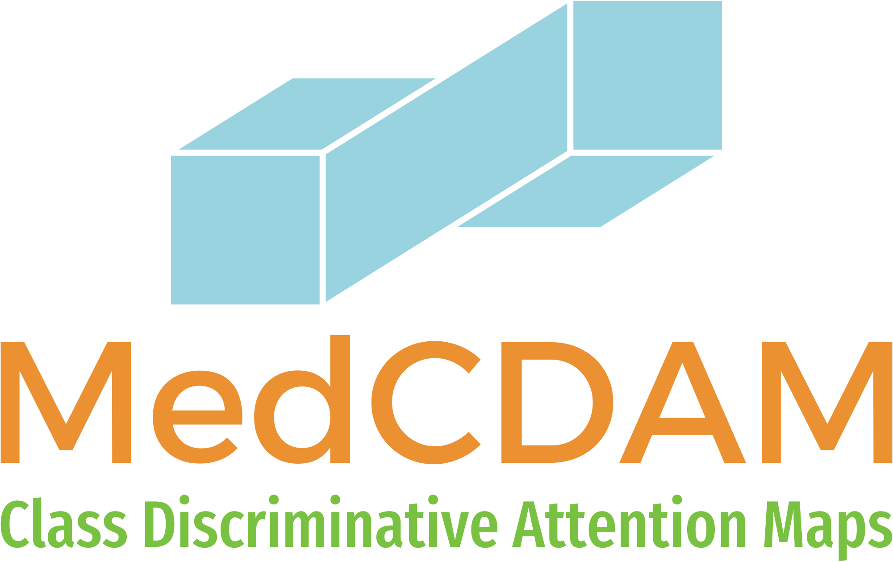

# Explaining the Vision Transformers for Medical Images using Class-Discriminative Attention Maps (CDAM)

<div align="center">
  
</div>


## Overview
This repository contains code needed to reproduce results of `Explaining the Vision Transformers for Medical Images using Class-Discriminative Attention Maps (CDAM)` project. This project aims to apply in medical imaging domain Class-Discriminative Attention Maps (CDAM). CDAM code mostly based on implementation developed by Brocki and Chung, 2023 ([arxiv](https://doi.org/10.48550/arXiv.2312.02364)).


### Prerequisites:
1. Clone repository and move into the project directory:
```bash
git clone https://github.com/jbindaAI/LIDC_ViTs.git
cd LIDC_ViTs
```
2. Create python virtual environment:
```python
python3 -m venv venv
```
3. Activate virtual environment and install requirements:
```bash
source venv/bin/activate
pip3 install -r requirements.txt
```
4. Download LIDC-IDRI dataset and preprocess it: </br>
Dataset is available there: [LIDC-IDRI](https://www.cancerimagingarchive.net/collection/lidc-idri/). To download it, follow a publisher instructions. </br>
Data preprocessing should be done as in a paper: [Integration of Radiomics and Tumor Biomarkers in Interpretable Machine Learning Models](https://doi.org/10.3390/cancers15092459). </br>
I preprocessed data in batches with `dataset_creation.py` script. Data after preprocessing, should be placed in `dataset` directory.

5. Create empty directory and download into it pretrained DINOv2 backbones:
```bash
mkdir pretrained
cd pretrained
wget https://dl.fbaipublicfiles.com/dinov2/dinov2_vits14/dinov2_vits14_reg4_pretrain.pth
wget https://dl.fbaipublicfiles.com/dinov2/dinov2_vitb14/dinov2_vitb14_reg4_pretrain.pth
cd ..
```

7. Download already preprocessed data: [OPTIONAL] </br>
If you want to faster make your setup, you can directly download `dataset.tar.gz` file containing preprocessed dataset. </br>
Download: [Google Disc](https://drive.google.com/file/d/1zWsmqwdAMKKcz3hvbc4CFXh6MRIM7Yw9/view?usp=sharing) </br>
It contains everything you need to perform training/evaluation -> nodule crops, fitted normalization factors, dataset splitting pattern. </br>
You may find useful command for downloading things from google disc:
```bash
gdown https://drive.google.com/uc\?id\=1zWsmqwdAMKKcz3hvbc4CFXh6MRIM7Yw9    
```
   
9. Download already fine-tuned checkpoints: [OPTIONAL] </br>
Version 0 of checkpoints trained on the first fold are available below: </br>
Rest of checkpoints are available on a request. 

## Author
Jakub Binda

## Licence
MIT

Logo generated with: </br>
[https://logo.com/](https://logo.com/)
